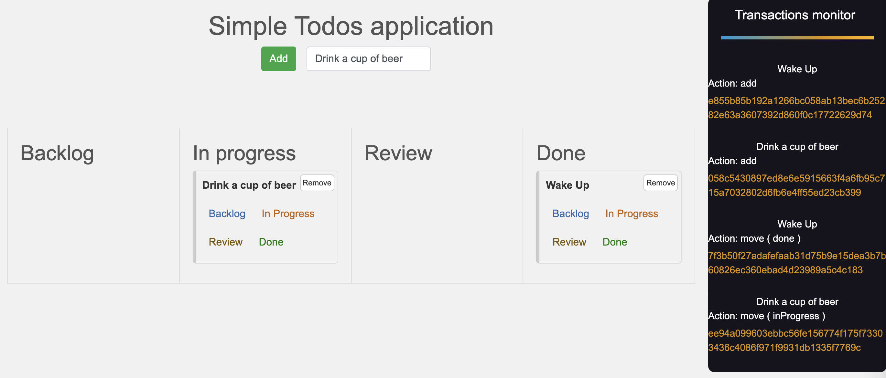
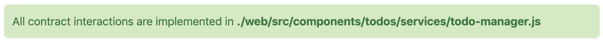
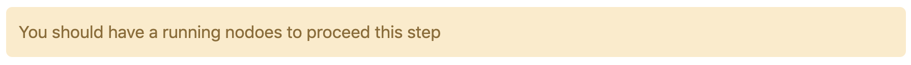

# eoslime-shape-react



The purpose of the project is to help you onboard on EOS easily by examples.

Project includes

* smart contract
* deployment script
* unit tests
* web interface

# Overview

The shape represents a Todo Manager dApp showing you how to connect front-end to EOS blockchain



Functionality is as simple as

* Add a new Todo
* Move an existing Todo
* Remove an existing Todo

# Prerequisities

### Installation

```bash
# Install EOSLime globaly to use the CLI
npm install -g eoslime

# Fetch the project
eoslime shape react

# Install dependencies
cd eoslime-shape-react
npm install
```

### Compile contract

```bash
# The command will read contract files from ./contracts folder
# Output will be stored as .abi and .wasm files in ./compiled folder

eoslime compile
```

### Deploy contract



```bash
# The command will run deployment script from ./deployment folder

eoslime deploy
```
The script will do several things

* Will create a random account and will deploy the contract code on it
* Will create a random account for Alice. She will make transactions to the contract
* Both accounts will be uploaded in .config file located at ./web/src/config.json

# Start


```
npm run start
```

TodoManager dApp is on http://localhost:3000/

# Tests

Check smart contract behavior by running unit tests

```bash
# The command will run unit tests from ./tests folder

eoslime test
```
